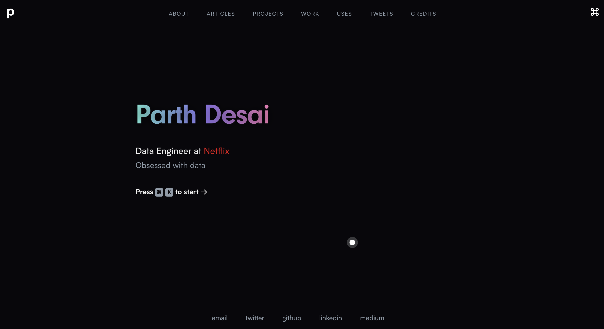
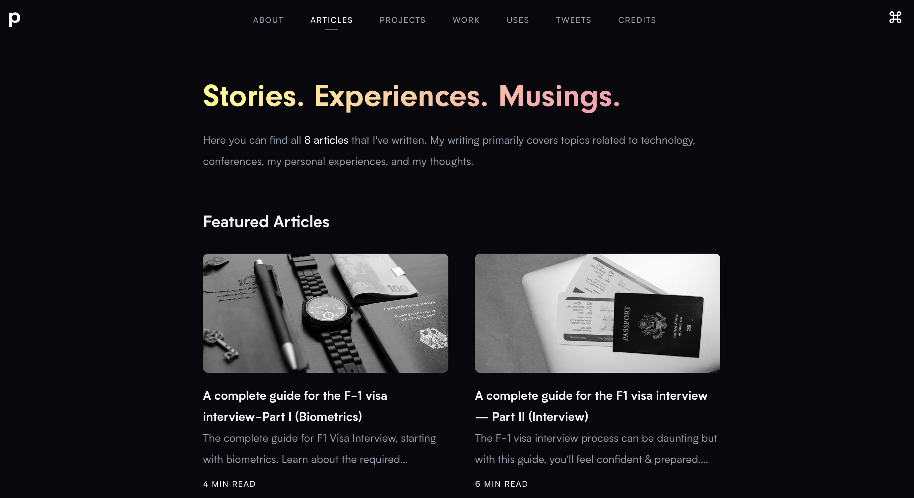
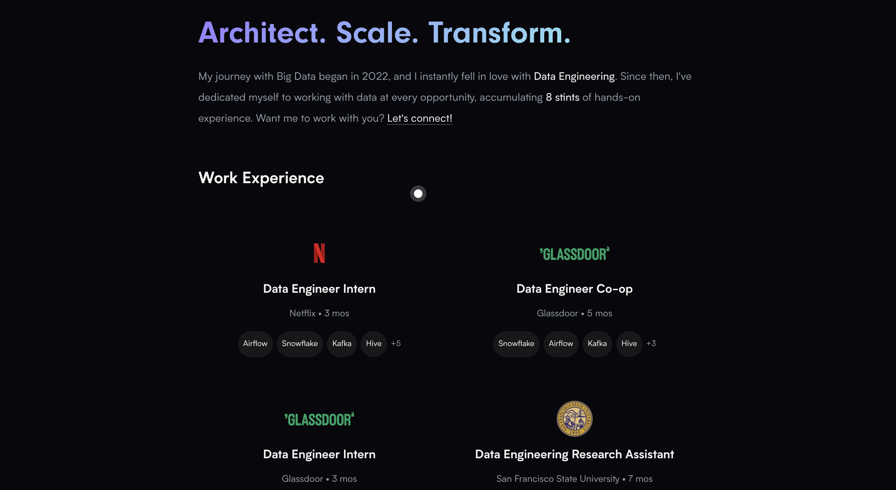

------
# Victor Sabare's Portfolio

[](https://sabare.tech)
[](http://sabare.tech/license)
[](https://nextjs.org/)
[](https://stitches.dev/)
[](https://www.framer.com/motion/)

> My personal website and blog, built to showcase my work, writing, and journey in data, cloud, and software engineering.

---

## 🌐 Live Demo

👉 [https://sabare.tech](https://sabare.tech)

---

## ✨ Features

* **Modern Design:** Sleek, minimal, and responsive UI with elegant gradients and glassmorphism.
* **Animated Interactions:** Smooth animations using Framer Motion.
* **Blog Engine:** Markdown-powered blog posts with code highlighting.
* **Projects Section:** Showcasing personal and professional projects.
* **About Me:** Interactive biography with animations and fun facts.
* **Uses Page:** Tech stack, tools, and preferred workflows.
* **SEO Optimized:** Open Graph, Twitter Cards, and JSON-LD structured data.
* **Dark Mode:** Accessible and visually balanced themes.
* **Deployed on Vercel:** Fast and scalable deployment.
* **Notion-Powered Connections:** Dynamic list of professional connections powered by Notion.
* **Command Bar:** Keyboard-based navigation for power users.
* **Mobile-First Experience:** Optimized navigation and layout for mobile devices.

---

## 📸 Screenshots

| Home                                               | Blog                                                   | Work Experience                                    |
| -------------------------------------------------- | ------------------------------------------------------ | -------------------------------------------------- |
|  |  |  |

---

## 🛠️ Technology Stack

* **Styling:** [Stitches](https://stitches.dev/)
* **Content:** [Markdown](https://daringfireball.net/projects/markdown/)
* **Back-end:** [Next.js](https://nextjs.org/)
* **Front-end:** [React](https://reactjs.org/)
* **Animation:** [Framer Motion](https://www.framer.com/motion/)
* **Deployment:** [Vercel](https://vercel.com/)
* **Integrations:** [Notion API](https://developers.notion.com/)

---

## 🚀 Getting Started

1. **Clone this repo:**

   ```sh
   git clone https://github.com/sabareh/portfolio.git
   cd portfolio
   ```

2. **Install dependencies:**

   ```sh
   npm install
   ```

3. **Run locally:**

   ```sh
   npm run dev
   ```

4. **View in browser:**

   ```
   http://localhost:3000
   ```

---

## 📁 File Structure

```
.
|-- articles      # Markdown blog posts
|-- components    # Reusable React components
|-- data          # Data for projects, uses, work, etc.
|-- layouts       # Page and post layouts
|-- lib           # Utilities and helpers
|-- pages         # Next.js pages
|-- public        # Static assets (images, icons, etc.)
```

---

## 🌟 Special Sections

### 🧑‍💼 Connections

A growing list of inspiring people I’ve worked with or admire—powered by a dynamic [Notion database](https://sabare.tech/connections).

* **Live Cards:** Rich cards with role, company, status, and tags.
* **Filter & Search:** Quick search and filtering by name or category.
* **Animated Details:** Modals for expanded profiles.
* **Status Tags:** Track people I’ve met or plan to meet.
* **Always Up-to-date:** Synced from Notion in real time.

### 📚 Articles

* Written in Markdown with syntax highlighting.
* Table of Contents with anchor links.
* Fully SEO and share optimized.

### 🛠 Uses

* See [what I use](https://sabare.tech/uses) for daily productivity, development, and creativity tools.
* Tools, apps, and hardware listed with descriptions and links.

### 🏆 Projects & Work

* Year-wise categorized portfolio with project highlights.
* Work experience with tools, teams, and accomplishments.

---

## 🤝 Contributing

If you have ideas for improvement:

1. Fork the repo
2. Create a new branch (`git checkout -b feature/your-feature`)
3. Commit your changes (`git commit -am 'Add new feature'`)
4. Push to the branch (`git push origin feature/your-feature`)
5. Open a Pull Request

---

## 🙋‍♂️ Author

| Field    | Info                                                   |
| -------- | ------------------------------------------------------ |
| Name     | Victor Oketch Sabare                                   |
| Website  | [sabare.tech](https://sabare.tech)                     |
| Twitter  | [@sabare\_victor](https://twitter.com/sabare_victor)   |
| LinkedIn | [victor-sabare](https://linkedin.com/in/victor-sabare) |

---

## 📄 License

[MIT License](http://sabare.tech/license) © Victor Sabare

---

Would you like me to generate a PDF version of this as well?
